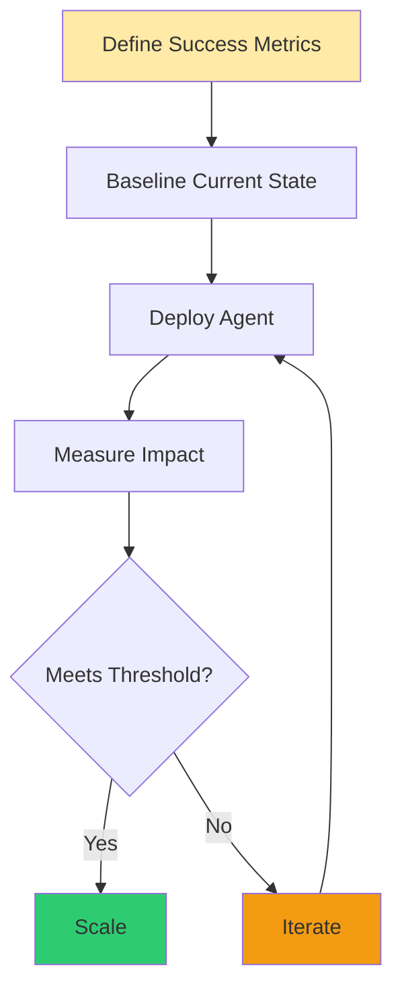

The AI agent hype cycle is in full swing. Every vendor promises autonomous systems that will revolutionize your business. Most will fail - not because the technology isn't ready, but because organizations are building on sand instead of rock.

After leading automation initiatives and implementing multi-agent systems in production environments, I've learned a hard truth: **the organizations that succeed with AI agents aren't the ones with the fanciest models. They're the ones who did the boring work first.**

## The Foundation Problem

**Here's what typically happens:** A company sees a compelling demo of an AI agent handling customer support or automating workflows. Leadership gets excited. A proof-of-concept gets greenlit. Initial results look promising.

Then reality hits.

The agent hallucinates because it's working with inconsistent data. It can't scale because processes weren't documented. ROI becomes impossible to measure because success metrics weren't defined upfront. The architecture can't evolve because it was built for the demo, not for production.

> [!Note] The failure wasn't in the AI. The failure was in the foundation.

## The Four Pillars of Sustainable AI Agent Implementation

### 1️⃣ Structured Data: Your Agent Is Only As Good As Its Inputs

AI agents don't magically fix messy data. They amplify it

Before deploying agents that make decisions, you need:

- **Clean, consistent data schemas** across systems
- **Well-defined data ownership** and governance policies
- **Audit trails** that track data lineage and transformations
- **Validation layers** that catch garbage before it reaches the agent

**Imagine this scenario:** A manufacturing company wants an AI agent to optimize production schedules. Before a single line of agent code is written, the team discovers that different plants report machine downtime in completely different formats — some in hours, some in minutes, some with free-text descriptions. The first month is spent not on AI, but on standardizing that data. That foundational cleanup is what makes the eventual agent 10x more effective than a rushed deployment ever would have been.

### 2️⃣ Documented Processes: Agents Execute, They Don't Invent

The best AI agents codify expert judgment at scale. But you can't automate what you haven't documented.

Effective process documentation for AI agents includes:

- **Decision trees** with clear branch logic and exception handling
- **Success criteria** that can be programmatically evaluated
- **Escalation paths** for edge cases and ambiguous situations
- **Failure modes** and rollback procedures

**Imagine this scenario:** A company wants to automate procurement approvals for low-risk requests. The moment the team tries to define "low-risk" precisely enough for an agent to act on it, they realize the definition doesn't exist on paper — it's tribal knowledge distributed across a handful of senior staff. Two weeks of extracting and formalizing those rules results in an agent that handles 60% of requests autonomously, but only because the other 40% is now explicitly documented as "requires human review".

> [!Note] The Paradox
> The less documentation you have, the more you feel you need agents. But agents work best when processes are already well-defined.

### 3️⃣ Clear ROI: Measure What Matters, Not What's Easy

If you can't measure success, you can't justify continued investment.

Before deployment, define:

- **Baseline metrics** for current-state performance
- **Success thresholds** that justify the investment
- **Leading indicators** that predict longer-term outcomes
- **Cost tracking** for both agent operations and human oversight

Be honest about what you're optimizing for. Time saved? Error reduction? Throughput increase? Customer satisfaction? Pick metrics that align with business outcomes, not vanity metrics like "number of queries handled."

**Imagine this scenario:** A support team launches an AI agent and celebrates hitting 1,000 inquiries handled per day. Then someone looks at resolution quality — 40% of those conversations required follow-up human contact, meaning the agent "handled" them but didn't actually resolve them. After retuning the system to optimize for resolution quality instead of raw volume, throughput drops but customer satisfaction rises 23%. The metric you choose to optimize changes everything.

> [!Note] The discipline
> Treat AI agent deployments like any other engineering project. Set OKRs. Track them. Kill what doesn't work.

### 4️⃣ Scalable Architecture: Build for the System You'll Have, Not the One You Have

Most AI agent projects start small. The successful ones think big from day one.

Architectural principles that enable scale:

- **Modular design** where agents are composable, not monolithic
- **State management** that handles concurrent operations and recovery
- **Observability** with logging, tracing, and performance monitoring
- **Version control** for prompts, workflows, and configuration
- **Security by design** with least-privilege access and audit logs

**Imagine this scenario:** A customer support system is built around four specialized agents — one for triage, one for context retrieval, one for response generation, and one for escalation routing. Each has a single, well-defined responsibility. When response quality needs improvement, only the generation agent gets updated — the others stay untouched. When traffic spikes 5x, each agent scales independently without a full system rewrite. That's what composable architecture makes possible.

## The Uncomfortable Truth About AI Agent Readiness

Most organizations aren't ready for production AI agents — not because of technology limitations, but because of organizational maturity.

Ask yourself honestly:

- Can you trace a decision your agent made back to the data that informed it?
- If an agent makes a mistake, can you identify why and prevent recurrence?
- Do you have the operational discipline to monitor agent performance continuously?
- Can your team explain to an auditor or regulator how your agents work?

If the answer is "no" or "sort of", **the best investment you can make isn't in fancier AI models. It's in the foundations.**

## Start Here: A Pragmatic Implementation Path

For organizations serious about AI agents:

1. **Audit your current state** — Document your data quality, process maturity, and measurement capabilities
2. **Pick one high-value, low-complexity process** — Automate something that has clear inputs, outputs, and success criteria
3. **Build instrumentation first** — Set up logging, monitoring, and feedback loops before deploying the agent
4. **Run in shadow mode** — Let the agent make recommendations that humans review before taking action
5. **Measure obsessively** — Track accuracy, performance, cost, and business impact weekly
6. **Iterate based on data** — Use real-world performance to tune thresholds, improve prompts, and refine workflows

The organizations winning with AI agents aren't the ones rushing to deploy. They're the ones building systematically, measuring rigorously, and scaling responsibly.

---

If you're a CTO, technical director, or engineering leader evaluating AI agents, the question isn't "which model should we use?" or "which vendor should we pick?"

The question is: **"Is our organization ready?"**

And if the answer is "not yet," that's not a failure — it's an opportunity. The work you do now — structuring data, documenting processes, defining metrics, building scalable architecture — will pay dividends far beyond AI agents. These are the fundamentals of operational excellence.

**The teams that treat AI agents as engineering projects, with clear requirements, measurable outcomes, and solid foundations, will build systems that compound value over years.**

**The teams that treat them as magic will build expensive prototypes that never make it to production.**

> [!Note] Choose wisely. Build well. Measure ruthlessly.
