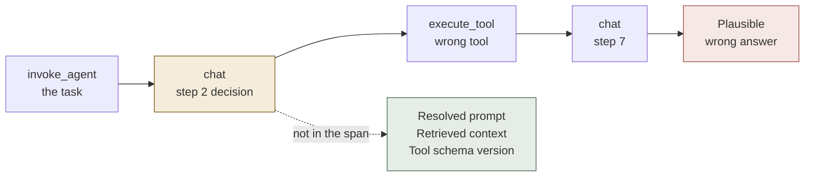
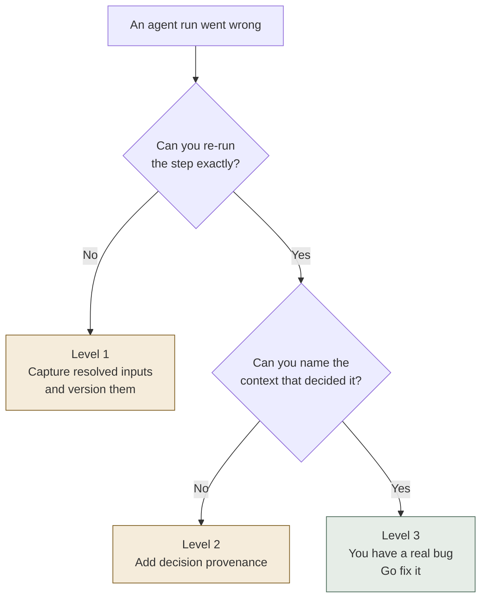
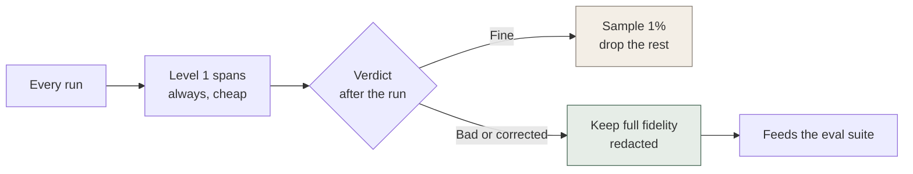

The advice everyone gives about running agents in production is "add tracing." It's correct advice, and it will help you less than you expect.

I've watched teams instrument an agent properly — a span for every model call, every tool invocation, token counts, latency breakdowns, the full picture — and then sit in a debugging session two weeks later completely stuck. The traces were there. They were accurate. Nobody in the room could explain why the agent had done what it did.

That isn't an instrumentation failure. It's a category error. Tracing was built to answer *what happened, and where was it slow*. Debugging an agent means answering *why did it choose that*. Those are different questions, and they need different data.

## A normal failure is loud. An agent failure is plausible.

In a conventional service, a failure announces itself. There's an exception, a 500, a timeout. Better still, the service is deterministic given its input: if you kept the request, you can replay it, and the bug will happen again in front of you.

An agent run is not reproducible from its trace by default. Same task, same deployed code, different outcome — because the things that actually varied aren't in your span.

The prompt wasn't a constant; it was assembled at runtime from a template, some memory, and whatever the retriever happened to return that second. The tool schema was serialized from code that shipped yesterday afternoon. The model version moved underneath you. Any one of those changes the decision, and none of them appear in a standard span.

So you end up holding a complete, accurate record of a run you cannot re-create. That's an anecdote, not a bug report.

There's a second problem stacked on top. In a multi-step agent, a bad decision at step two doesn't fail at step two. It propagates — the error cascades quietly through the rest of the chain and surfaces ten spans later as a confident, well-formed answer to the wrong question. The span that looks broken is almost never the span that broke.

*The trace records the shape of the run. The dotted box holds everything that determined the decision — and it's the box that standard instrumentation leaves empty.*

## The four levels of agent traceability

It helps to stop treating observability as a binary you either have or don't, and start treating it as a ladder. Each rung answers a different question, and costs more than the one below.

| Level | What you capture | Question it answers | What it costs |
|---|---|---|---|
| **0 · Logs** | Timestamps, errors, free text | Did it run? | Nothing |
| **1 · Spans** | `invoke_agent` → `chat` → `execute_tool`, latency, tokens, model name | What shape was the run, and where was it slow? | Instrumentation effort |
| **2 · Resolved inputs** | The final prompt after templating, retrieved chunks, tool schemas as presented, model and parameter versions | Can I re-run this exact step? | Storage, and a data-retention conversation |
| **3 · Decision provenance** | Which context influenced the branch, what the alternatives were, the eval verdict linked back to the span | Why did it choose that? | Design work — this one you build, not buy |

Level 1 is where the industry has standardized, and that's genuine progress. The [OpenTelemetry GenAI semantic conventions](https://opentelemetry.io/blog/2026/genai-observability/) define exactly this shape — a top-level `invoke_agent` span with child `chat` spans for each model call and `execute_tool` spans for each tool invocation, carrying attributes like `gen_ai.request.model` and `gen_ai.usage.input_tokens`. Most of it is still marked experimental, but vendors are already shipping against it. Adopt it; don't invent your own schema in 2026.

Just be honest about what it buys you. Level 1 tells you the agent made four tool calls and the third one was slow. It does not tell you why it called that tool.

Most teams buy a tracing vendor, land at Level 1, and are quietly surprised that debugging didn't get easier.

## The test that tells you which level you're actually on

Take your last real agent incident. From the trace alone — without asking the person who built it — answer three questions:

1. **Can I re-run this step and get the same output?**
2. **Can I point at the specific piece of context that produced the choice?**
3. **Can I tell whether it was the model, the retrieval, or the tool contract?**

If any answer is no, you're one level below where you thought you were. Most teams who believe they're at Level 2 discover they're at Level 1 with good intentions.

*Two questions, three outcomes. Only the rightmost branch is debugging — the other two are instrumentation work wearing a debugging costume.*

## Why everyone stops at Level 1, and what to do instead

The honest reason is not laziness. Level 2 means storing the resolved prompt and the content your retriever pulled in. That's frequently customer data. It's real storage cost. It's a retention-policy conversation with someone who has no interest in your agent whatsoever. OpenTelemetry makes content capture opt-in for precisely this reason, and they're right to.

But "we can't store everything" quietly became "we store nothing," and that substitution is the actual mistake. The answer was never supposed to be uniform.

Standard head-based sampling is exactly the wrong instinct here. It keeps a random 1% — and the runs you need are, by definition, the rare ones. What you want is retention biased toward failure: decide *after* the run whether the expensive detail is worth keeping, driven by whatever verdict you already have. A thumbs-down. An eval score. A human correcting the output downstream.

*Cheap on the happy path, expensive only where it pays. The runs worth storing in full are the ones someone already told you were wrong.*

## Where to start on Monday

1. **Adopt the OTel GenAI span shape now.** `invoke_agent` / `chat` / `execute_tool`. A schema you didn't design is a schema you don't have to migrate.
2. **Give the task a run ID that outlives the request.** Agent work spans retries, handoffs and sometimes days. Request-scoped correlation loses the plot exactly when it gets interesting.
3. **Version everything that can change a decision** — model, prompt template, tool schema, retrieval index. If it can move, it needs a version in the span, or you'll spend a debugging session arguing about what was deployed.
4. **Capture resolved inputs on a sample, and always on failure.** Redact at write time, not at read time.
5. **Write the eval verdict back onto the trace as an attribute.** The moment "bad output" becomes queryable, quality stops being a vibe and starts being a filter.

None of this requires a platform migration. Items two and three are usually a day of work each, and they're the two that convert an anecdote into something you can actually reproduce.

## Takeaways

1. **Tracing answers "what happened." Debugging an agent asks "why did it choose that."** Buying the first and expecting the second is the most common instrumentation mistake in production agents right now.
2. **If you can't re-run a step and get the same output, you don't have a bug — you have a story.** Reproducibility is the line between the two.
3. **The span that looks broken is rarely the span that broke.** A bad decision surfaces several steps downstream, wearing a plausible answer.
4. **Version every input that can move the decision:** model, prompt template, tool schema, retrieval index. Cheap to add, and it ends most debugging arguments before they start.
5. **Bias retention toward failure, not toward randomness.** Head-based sampling throws away exactly the runs you needed.

---

If the engineer who built your agent left tomorrow, could anyone else explain why last Tuesday's run went wrong — from the trace, without asking them? That's the observability question that actually matters, and it has nothing to do with how many dashboards you have.
