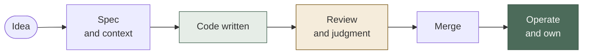
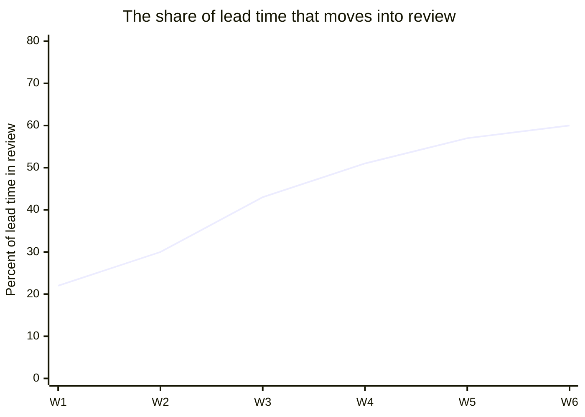
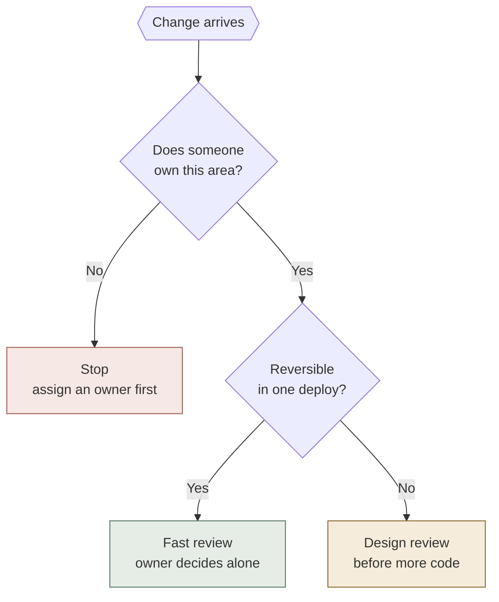
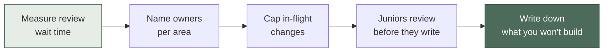

Every engineering manager I talk to is asking a version of the same question: *if agents write the code, what am I managing?*

The question assumes writing code was the job. It wasn't. It was never even the constraint.

Think about the last quarter your team missed something. Was it because people couldn't type fast enough? Or was it because a decision sat for nine days waiting for the one person who understood the billing module, and by the time it moved, three other changes had been built on top of the wrong assumption?

Agents made the cheapest step in your pipeline cheaper. That's genuinely useful. It's also why the job feels harder, not easier — the constraint didn't disappear, it moved somewhere you have less tooling and no dashboard.

## The bottleneck moved one station down the line

Agents collapsed step C. Steps B, D and F are still done by humans, at exactly the same speed as last year — and now they receive three times the volume.

This isn't a hunch. DORA's [2025 State of AI-assisted Software Development report](https://dora.dev/research/2025/dora-report/) found that AI adoption correlates positively with throughput *and* with higher software delivery instability at the same time. More changes go out. More of them come back. Their framing is the one I'd underline for any manager: AI amplifies whatever your system already is. If review was thin before, it's now the thing that breaks.

So the job becomes four things it wasn't before.

## 1. You manage a review economy, not a build queue

Capacity planning used to mean: how many engineer-weeks do we have. It now means: how many changes can we responsibly absorb.

Those are different numbers, and only one of them went up.

The practical consequence is that review stops being something engineers do in the gaps between "real work" and becomes the scarce resource you allocate on purpose. That means naming it in sprint planning, protecting it in calendars, and — the part nobody likes — capping work in progress. A reviewer with eleven open changes is not reviewing. They're skimming and approving, which is the same as not reviewing, with a signature attached.

The number I'd hold a team to: **three in-flight changes per reviewer, maximum.** Not because three is magic, but because a hard cap forces the conversation about what actually needs to ship this week. Without a cap, an agent-heavy team will happily generate more diff than it can ever understand.

## 2. Coherence becomes the scarce good

Agents produce code that is locally correct and globally incoherent.

Each change is defensible on its own. It passes tests. It does what the ticket said. And after six weeks you have four different retry strategies, three ways of handling dates, and two competing abstractions over the same integration — none of which any single person decided, because no single person saw all four changes.

This is the failure mode I'd watch hardest, because it doesn't show up in any metric you currently track. Velocity looks great. Change failure rate looks acceptable. The system is quietly becoming unexplainable.

Somebody has to hold the shape of the system in their head and say "no, we already do that, over there." Historically that emerged for free from the fact that a small number of people wrote everything. It doesn't emerge for free anymore. You have to staff it: named owners per area, with the authority to reject a technically-correct change for being architecturally wrong.

## 3. You have to manufacture the judgment that boilerplate used to teach

Here's the uncomfortable one.

Junior engineers used to learn by writing the tedious 80% — the CRUD endpoint, the mapper, the fifth integration test. It was slow and it felt like waste, and it was also the mechanism by which someone spent two hundred hours inside a codebase and came out with intuition.

That path is gone. The tedious 80% is now free.

What's left for a junior is the hard 20%: reviewing code they didn't write, deciding what's worth building, debugging a system they never assembled by hand. Those are the *senior* skills. We removed the on-ramp and left the highway.

I don't think this is unsolvable, but it doesn't solve itself, and "they'll pick it up" is not a plan. It has to be deliberate: juniors review before they write, they own an area early and narrowly, they get put on incidents with a senior beside them rather than shielded from them. Apprenticeship stops being a by-product of the work and becomes something you design.

## 4. Restraint becomes a leadership skill

When building was expensive, cost did your prioritisation for you. Half the bad ideas died at the estimate.

Now they don't. Building is cheap, so everything gets built, and every merged feature is permanent maintenance — a surface someone will debug at 2am in three years.

The expensive decision is now *no*. And "no" is much harder to defend than it used to be, because the old argument ("it's three weeks of work") has evaporated. You need a new one, and it's this: the cost of a feature was never the building. It was the owning.

## What this looks like in a week

*Illustrative shape, not measured data.* What to look at is the direction, not the values: total lead time can fall while the proportion of it spent waiting for human judgment climbs. Teams celebrating the first number rarely instrument the second — and the second is the one that tells you where to put people.

| | Before agents | With agents |
|---|---|---|
| **Capacity question** | How many engineer-weeks? | How many changes can we absorb? |
| **Scarce resource** | Time to write code | Attention to review it |
| **What breaks first** | Delivery dates | Architectural coherence |
| **How juniors learn** | By writing the boring 80% | By judgment you design on purpose |
| **Hardest decision** | What to build next | What not to build at all |
| **Metric that lies** | Story points | Throughput without stability |

## Triaging changes when there are three times as many

The single highest-leverage change I'd make is to stop treating every incoming change as one thing. Most of them don't need a careful review. A few of them need a conversation *before* anyone writes code — and in an agent-heavy team, code is already written by the time you find out.

Two questions, three outcomes. Most changes land in the fast path, which is what buys you the attention to do the slow path properly on the ones that matter.

The "no owner" branch is the one people skip, and it's the important one. An unowned area accumulating agent-written changes is how a codebase becomes unexplainable — quietly, in about a quarter.

## What to do in the next 30 days

Start with the measurement, because you almost certainly don't have it. Not cycle time — the share of cycle time a change spends waiting for a human. If you can't produce that number today, that's your answer about where the constraint is.

Then name owners. Then cap the queue. Then rebuild the on-ramp. Then, once a month, write down the three things you decided not to build and why — it's the only artefact that makes restraint visible to the people above you.

## Takeaways

- **Writing code was never the bottleneck.** Agents made the cheap step cheaper and exposed the expensive ones: context, judgment, ownership.
- **Plan review capacity, not build capacity.** Cap in-flight changes per reviewer. A reviewer with eleven open PRs is a rubber stamp with a calendar.
- **Coherence needs an owner now.** It used to emerge from a small team writing everything. It doesn't emerge anymore — staff it deliberately.
- **Junior apprenticeship has to be designed.** The boilerplate that used to teach intuition is gone. Replace it with early ownership and review-before-write.
- **Track the share of lead time spent waiting on humans.** Throughput without stability is the metric that will flatter you right up until it doesn't.

The question I'd sit with: if your team's output tripled tomorrow, what would break first — and who, specifically, is responsible for that thing today?

If you can't answer with a name, that's the job now.
