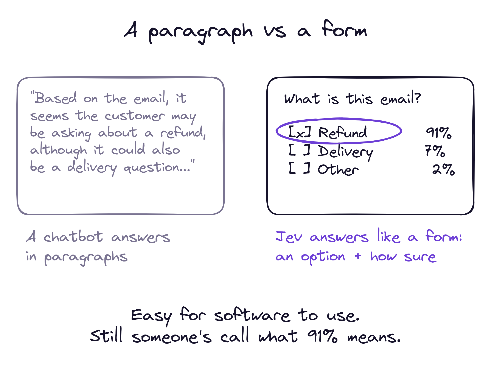
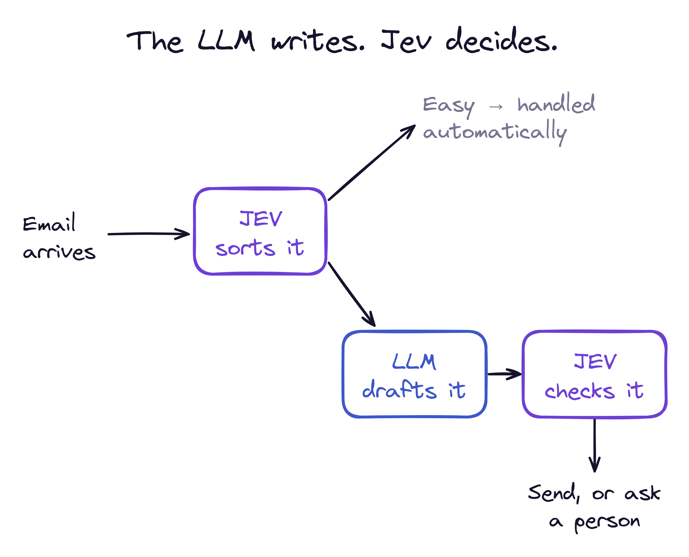
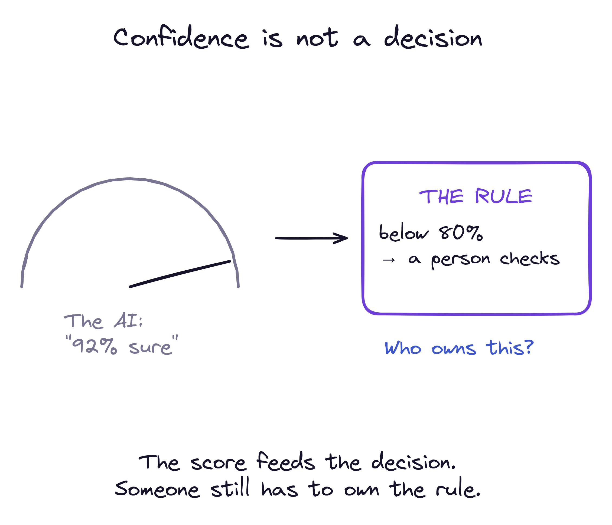
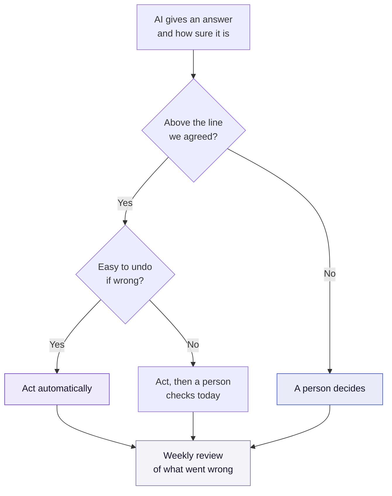

A new AI model launched this month with a promise that sounds almost too good: it can't give you the wrong kind of answer.

It's called Jev, and I think its design gets something important right about putting AI to work. I also think it makes it easier to forget the part that actually decides whether automation works. Both things can be true, so let's take them one at a time.

## How Jev works, in two minutes

Most AI tools you've used, like ChatGPT or Claude, are chat models. You ask a question and get back a paragraph. That's great for people. It's awkward for software, because a program then has to read the paragraph and guess what it meant.

Jev, from a startup called [TypeSafe AI](https://typesafe.ai/blog/introducing-system-one-models-and-jev), does something different. It doesn't write. It answers like a form.

You send it two things:

1. **The situation.** An email, a ticket, a record, a document. TypeSafe calls this the *state*.
2. **One or more typed questions** about it. The [documentation](https://docs.typesafe.ai/introduction) describes three kinds: pick one option from a list (*Choice*), rate something against levels you define (*Score*), or say how likely a statement is to be true (a yes/no probability).

For each question you get back an answer that is always one of the options you allowed, the probability of every option, and a confidence value. All the questions are answered at the same time, in one call.

A few more facts, all from TypeSafe itself:

- It launched in early access on 15 September 2026, and it's also offered through [Cloudflare](https://developers.cloudflare.com/ai/models/typesafe/jev/).
- They report 70 to 500 milliseconds per call, $0.042 per million input tokens, and no charge for output.
- It was trained specifically to give honest probabilities, not to sound convincing.

## LLM vs Jev: different tools for different jobs

It's tempting to ask which one is better. That's the wrong question, a bit like asking whether a writer or a checklist is better. They do different jobs.

An **LLM** (a large language model, the kind behind ChatGPT or Claude) is a writer and a thinker. It reads, explains, drafts, summarises and works through problems step by step. Its answer is text, and it can take seconds.

**Jev** is a decider. It reads a situation and picks from options you've already defined, with a number that says how sure it is. Its answer is a value your software can act on, and it comes back in well under a second.

| | LLM (ChatGPT, Claude...) | Jev |
|---|---|---|
| **What you get back** | Text: an answer, a draft, an explanation | One of the options you defined |
| **Can it answer outside your options?** | Yes, and sometimes does | No, by design |
| **Does it say how sure it is?** | Not in a form software can use | Yes, a probability for every option |
| **Speed (as reported)** | Seconds, sometimes minutes | 70 to 500 milliseconds |
| **Best at** | Open questions, writing, multi-step reasoning | Fast, repeated decisions inside a process |
| **Weak at** | Being cheap and fast thousands of times a day | Anything where the answer isn't in a list |
| **What you still have to decide** | Whether the text is right | What "sure enough" means, and what happens when it isn't |

### When to use an LLM

Use an LLM when the answer can't be written down in advance:

- **Writing something new:** a reply to a customer, a summary of a long report, a first draft of a policy.
- **Explaining or reasoning:** "why did our returns go up last month?", "what's the risk in this contract?"
- **Conversations with people**, where the next question depends on the last answer.

### When to use Jev

Use Jev when you already know the possible answers and you need to pick one, fast and often:

- **Sorting:** is this email a refund, a delivery question or something else? Is this ticket urgent?
- **Checking:** does this invoice match the order? Does this record break a rule?
- **Scoring:** how risky is this change, on a scale you define?

If the same small decision happens hundreds or thousands of times a day, it's Jev-shaped.

### When to use both

This is where it gets interesting, because the two fit together well. The idea is simple: **the LLM thinks and writes, Jev decides along the way.** Three patterns I'd look at first:

1. **Jev sorts, the LLM handles the hard cases.** Jev reads every incoming email and decides what it is and how hard it is. Simple ones follow a fixed path. Only the messy ones go to the LLM, which is slower and costs more. You pay for thinking only where thinking is needed.
2. **The LLM writes, Jev checks.** The LLM drafts a reply. Before it's sent, Jev answers a few narrow questions about the draft: does it promise a refund? Does it mention a price? Is the tone right? Anything that fails goes to a person.
3. **Jev as the safety check inside an AI agent.** When an AI agent is about to do something (send an email, change a record, delete a file), Jev is asked one question first: is this action risky? If yes, it stops and asks a human.

The pattern behind all three is the same one I'd use with people: let the creative work be creative, and put simple, clear checks at the points where a mistake costs money.

## Why this is the right shape for automation

TypeSafe's launch post makes a point I've learned the hard way in factories and support queues: if a model gets a task right 95% of the time but can't tell you when it's in the other 5%, you can't hand it that task.

That's exactly right. The problem with automating decisions was never that the AI is sometimes wrong. People are sometimes wrong too. The problem is not knowing *which* answers to trust. A model that says "refund, 91% sure" gives your process something to hold on to. A paragraph doesn't.

So the interface is a real step forward. My worry is what people will do with it.

## A confidence score is not a decision

When a model hands you "91%", it's tempting to feel the job is done. It isn't. The model has told you how sure it is. It hasn't told you what to do about it.

Four questions come with no model, from any vendor:

1. **Who decided what "sure enough" means?** Is 80% enough to refund someone automatically? For a €20 order, maybe. For a €2,000 one, maybe not. That's a business decision, not a model setting.
2. **What happens below that line?** Ask again, send it to a person, or stop safely? If nobody wrote this down, the answer is "whatever the code happens to do."
3. **Who owns the mistakes it made while feeling sure?** The dangerous errors aren't the 55% ones. They're the 95% ones that turn out wrong, because nothing catches them.
4. **Who notices when it slowly gets worse?** A model's confidence is only honest for the kind of inputs it has seen. Change your products, your customers or your forms, and "91%" can quietly stop meaning 91%.

Factories solved this decades ago. A sensor that reports how reliable its own reading is: very useful. But what keeps people safe is the interlock, the rule that stops the machine, and the engineer whose name is on that rule. The sensor feeds the decision. It isn't the decision.

## What that looks like in practice

Here's the simplest version of the rule I'd want written down before a model like this makes a single real decision:

Take a returns inbox. Jev reads each email and says "refund request, 91% sure." With the rule above, a small refund over the line goes through on its own. A large one goes through and gets a same-day look. Anything under the line goes to a person, as it does today. And every week someone looks at the cases where the AI was confident and wrong, and decides if the line should move.

None of that is clever. All of it is ownership.

## Read the fine print, then test it yourself

To TypeSafe's credit, their own launch post is honest about the limits of their numbers. The big speed and cost gains come from workflows built by their own team, and they say real-world results will likely be lower. They haven't published a technical paper or model weights yet.

So treat the benchmarks as a reason to try it, not as a result. The only numbers that matter are the ones from your decisions, on your data, measured against what your team does today.

## Conclusion

Jev is a good idea, well explained. It doesn't replace LLMs; it fills the gap next to them. An LLM for thinking and writing, a model like Jev for the many small, repeated decisions in between, and the two together where a process needs both.

But it moves the hard part rather than removing it. Before, the question was "can we trust the AI's answer?" Now it's "who decided what we do with a 91%, and who's watching when that stops being true?" That question has always belonged to people. A better model makes it easier to answer. It doesn't answer it for you.

**Takeaways:**

- **Pick the tool by the shape of the answer.** Text or reasoning: an LLM. A choice from a known list, many times a day: Jev. Both in one process: let the LLM write and Jev decide.
- **Use the confidence, don't obey it.** A probability is an input to your rule, not the rule.
- **Write the line down before go-live**, with a name next to it and a reason for the number.
- **Decide what happens below the line** for every decision you automate: retry, a person, or a safe stop.
- **Watch the confident mistakes weekly.** They're the ones nothing else catches.
- **Test on your own decisions.** Vendor benchmarks tell you where to start, not where you'll end up.

If an AI in your company started making one decision on its own next month, who would own the line?
